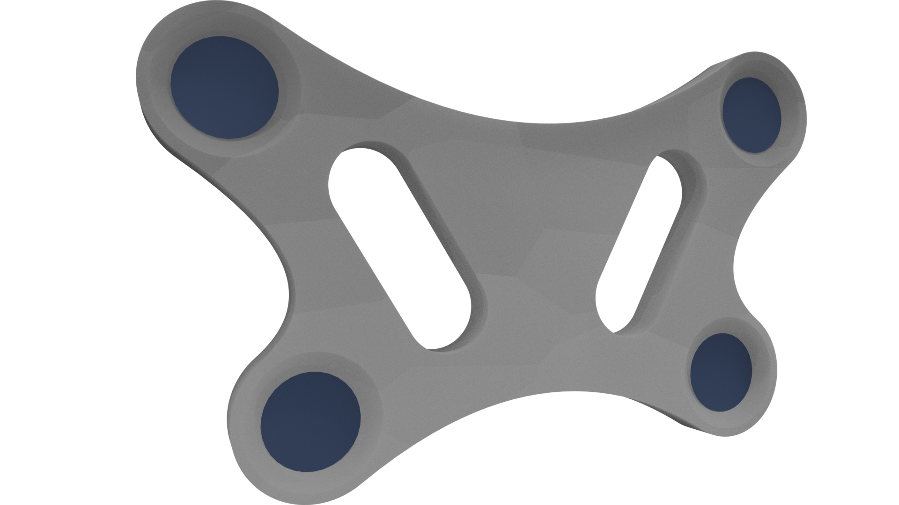
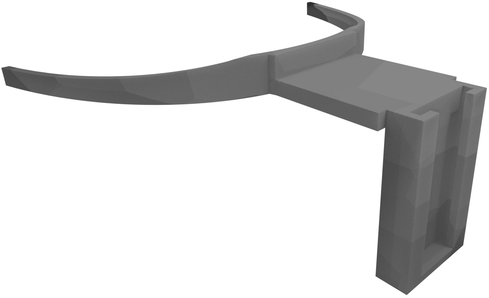
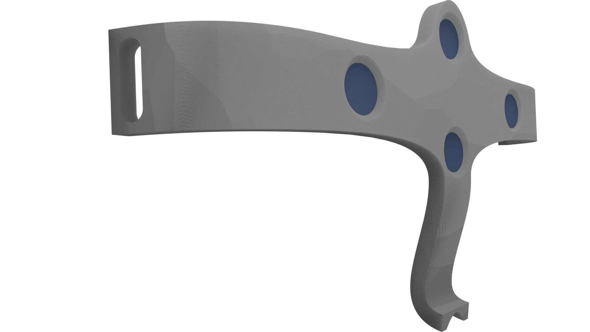
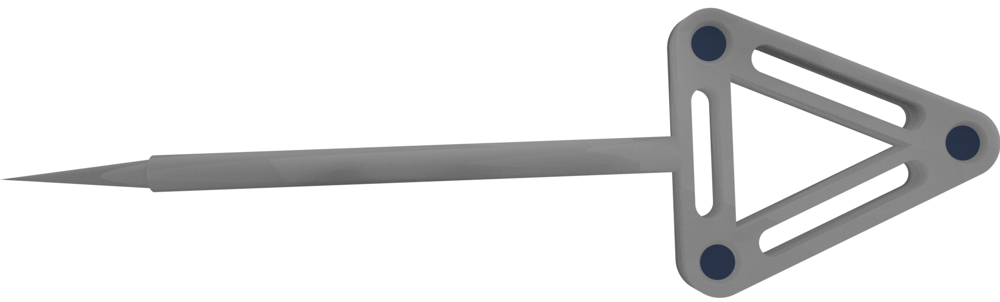
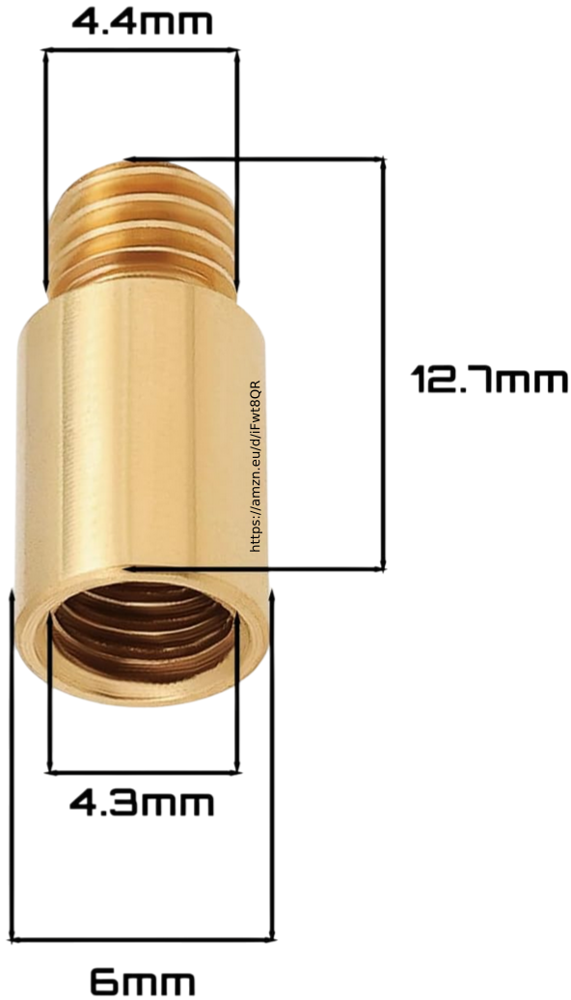
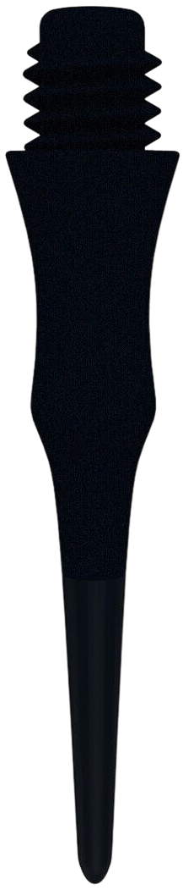
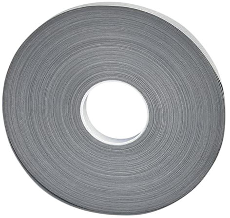
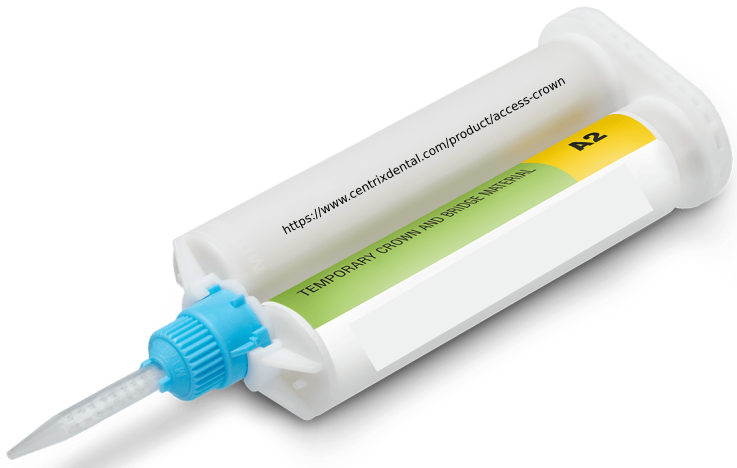
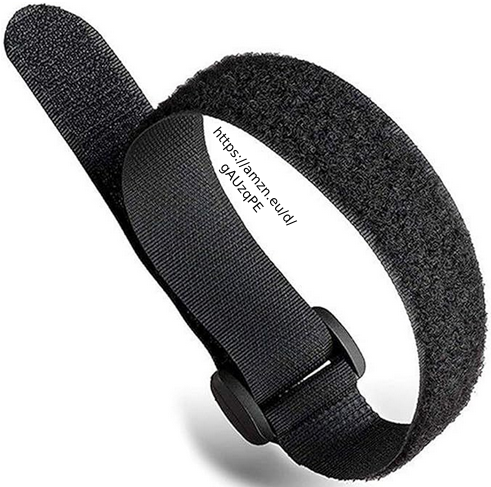

<a href="#"></a>
<a href="https://paulotto.github.io/projects/jaw-tracking-system/"></a>

# JawTrackingSystem (JTS): A customizable, low-cost, optical jaw tracking system

A modular and extensible Python package for analyzing jaw motion using motion capture data. 
Designed for research and clinical applications, it provides a flexible pipeline for calibration, 
coordinate transformations, registration, smoothing, visualization, and export of jaw kinematics.
The models for the hardware components are provided as STL files and inside a FreeCAD project file.

---

## Table of Contents
- [Features](#features)
- [Hardware](#hardware)
- [Installation](#installation)
- [Quick Start](#quick-start)
- [Configuration](#configuration)
- [Setup and Usage](#setup-and-usage)
- [Extending the Framework](#extending-the-framework)
- [Documentation](#documentation)
- [Examples](#examples)
- [Directory Structure](#directory-structure)
- [Testing](#testing)
- [License](#license)
- [Citation](#citation)

---

## Features
- **Customizable Hardware**: 3D-printable, low-cost components for jaw tracking
- **Flexible Analysis Pipeline**: Calibration, relative motion, coordinate transformation, smoothing, export
- **Motion Capture Support**: Abstract base classes for Qualisys (extensible to other systems)
- **Real-time & Offline**: Supports both offline analysis and real-time streaming (in development)
- **HDF5 Analysis Tools**: 
  - Split recordings by sub-experiments with automatic frame offset handling
  - Plot derivatives (velocity, acceleration) alongside trajectories
  - Compare raw vs smoothed data with comprehensive visualization
- **Easy Configuration**: JSON-based configuration system
- **Comprehensive Testing**: Test suite for core functionality (24 tests)
- **Well Documented**: Complete API reference and examples

## Hardware
The hardware components are designed to be low-cost and customizable. The models for the hardware components are 
provided as STL files and inside a FreeCAD project file. You can find the files in the [models](models) directory.

The mouthpiece, teeth attachment, headpiece, and digitizing pointer are designed to be 3D-printed. 
Since it isn't easy to 3D-print a sharp point for the digitizing pointer, a dart point is used, which can be attached 
to a 2BA thread connected to the digitizing pointer's tip.
For the reflective markers, you can use reflective fibers or reflective tape.
The headpiece can be attached and fastened to the head using hook-and-loop tape (see [Components](#components)).

### Components
|  |  |  |  |
|:------------------------------------------------------------------------:|:-------------------------------------------------------------------------------:|:-----------------------------------------------------------------------:|:------------------------------------------------------------------------------:|
|                                Mouthpiece                                |                                Teeth attachment                                 |                                Headpiece                                |                               Digitizing pointer                               |

|  |  |  |  |  |
|:---------------------------------------------------------------------:|:----------------------------------------------------------:|:----------------------------------------------------------------:|:---------------------------------------------------------------:|:------------------------------------------------------------------:|
|                              2BA thread                               |                         Dart point                         |                         Reflective fiber                         |                      Temporary dental glue                      |                         Hook-and-loop tape                         | 

## Installation

Install the package using pip:

```bash
python -m pip install jaw-tracking-system
```
From GitHub:
```bash
python -m pip install git+https://github.com/paulotto/jaw_tracking_system.git
```
Or just clone the repository, copy the `jts` directory to your project, and install the dependencies:

```bash
git clone https://github.com/paulotto/jaw_tracking_system.git 
cd jaw_tracking_system
cp -r jts your_project_directory/
python -m pip install -r requirements.txt
```

### Optional Dependencies
```bash
python -m pip install plotly==6.0.1 qtm_rt
```

## Quick Start

1. Prepare a configuration JSON file (see [README](config/README.md) for examples).
2. Run the analysis pipeline:

```bash
python -m jts.core path/to/config.json
```

3. Results (trajectories, plots, exports) will be saved to the output directory specified in your config.

## Configuration

All analysis parameters are specified in a JSON config file. Key sections include:
- `data_source`: Type (e.g., "qualisys"), filename, and system-specific parameters
- `analysis`: Calibration, experiment intervals, smoothing, coordinate transforms
- `output`: Output directory, file formats, export options
- `visualization`: Plotting options

See [config.json](config/config.json) for a template.

## Setup and Usage
TODO: Describe experimental setup, hardware assembly, and how to run the system.

### As a Script

```bash
python -m jts.core path/to/config.json
```

Optional flags:
- `--verbose` for detailed logging
- `--plot` to show plots interactively

### As a Library

```python
from jts.core import JawMotionAnalysis, ConfigManager

config = ConfigManager.load_config('path/to/config.json')
analysis = JawMotionAnalysis(config)
results = analysis.run_analysis()
```

## Extending the Framework

- Add new motion capture system support by subclassing `MotionCaptureData`.
- Implement new calibration or analysis routines by extending `JawMotionAnalysis`.
- Add new visualization or export utilities in `helper.py`.

## Documentation

- **[HDF5 Analysis Guide](docs/HDF5_ANALYSIS.md)** - Complete API reference for HDF5 analysis functions
- **[HDF5 Quick Start](docs/HDF5_QUICKSTART.md)** - Quick examples and common use cases  
- **[Configuration Guide](config/README.md)** - JSON configuration file reference

## Examples - Working With the Processed Data

The `examples/` directory contains scripts demonstrating key features. For comprehensive documentation, 
see **[HDF5 Analysis Guide](docs/HDF5_ANALYSIS.md)** and **[Quick Start](docs/HDF5_QUICKSTART.md)**.

### 1. Analyze HDF5 Files

Inspect, load, and visualize saved trajectory data:

```bash
python examples/hdf5_analysis_example.py output/jaw_motion.h5
```

### 2. Split by Sub-Experiments

Extract specific motion types from recordings:

```bash
python examples/split_hdf5_example.py jaw_motion.h5 config/config.json
```

This automatically:
- Detects frame offset from config (`frame_interval`)
- Splits file into sub-experiments (e.g., chewing, opening/closing)
- Recalculates derivatives for each segment

### 3. Working with HDF5 Files Programmatically

```python
import jts.helper as hlp
import matplotlib.pyplot as plt

# Inspect file structure
info = hlp.inspect_hdf5('jaw_motion.h5', verbose=True)

# Load transformation data
data = hlp.load_hdf5_transformations('jaw_motion.h5')
transforms = data['T_model_origin_mand_landmark_t']['transformations']  # (N, 4, 4)
derivatives = data['T_model_origin_mand_landmark_t']['derivatives']

# Access derivatives with convenient aliases
trans_vel = derivatives['translational_velocity']      # m/s
ang_vel = derivatives['angular_velocity']              # rad/s

# Visualize trajectory in 3D
hlp.visualize_hdf5_trajectory('jaw_motion.h5', frame_step=50)

# Compare trajectories (translations, rotations, derivatives)
hlp.compare_hdf5_trajectories('jaw_motion.h5', component='translations')
hlp.compare_hdf5_trajectories('jaw_motion.h5', component='translational_velocity')

# Split by sub-experiments
output_files = hlp.split_hdf5_by_sub_experiments(
    'jaw_motion.h5',
    config_file='config/config.json',  # Auto-detects frame_offset
    output_dir='sub_experiments/'
)

plt.show()
```

### Available HDF5 Functions

| Function | Description |
|----------|-------------|
| `inspect_hdf5()` | Inspect file structure and metadata |
| `load_hdf5_transformations()` | Load trajectory data with derivatives |
| `visualize_hdf5_trajectory()` | Create 3D trajectory visualizations |
| `compare_hdf5_trajectories()` | Compare trajectories (translations, rotations, derivatives) |
| `split_hdf5_by_sub_experiments()` | Split files by frame intervals with auto frame offset |

**📖 For complete API reference and advanced usage, see [HDF5 Analysis Documentation](docs/HDF5_ANALYSIS.md)**

## Directory Structure

```
jaw_tracking_system/
├── jts/                              # Core package
│   ├── __init__.py
│   ├── calibration_controllers.py   # Calibration point collection
│   ├── core.py                      # Main analysis pipeline
│   ├── helper.py                    # Utility functions and HDF5 tools
│   ├── plotly_visualization.py      # Interactive 3D visualization
│   ├── precision_analysis.py        # Precision and accuracy analysis
│   ├── qualisys_streaming.py        # Real-time Qualisys streaming
│   ├── qualisys.py                  # Qualisys data interface
│   └── streaming.py                 # Abstract streaming base classes
├── config/
│   ├── README.md                    # Configuration guide
│   └── config.json                  # Configuration template
├── docs/
│   ├── HDF5_ANALYSIS.md            # Complete HDF5 API reference
│   └── HDF5_QUICKSTART.md          # Quick start guide for HDF5 tools
├── examples/
│   ├── hdf5_analysis_example.py    # HDF5 inspection and visualization
│   └── split_hdf5_example.py       # Split files by sub-experiments
├── models/                          # 3D-printable hardware models
│   ├── JTS_Calibration_Tool.stl    # Digitizing pointer
│   ├── JTS_Head_Marker.stl         # Headpiece with markers
│   ├── JTS_Models.FCStd            # FreeCAD project file
│   ├── JTS_Mouth_Marker.stl        # Mouthpiece with markers
│   └── JTS_Teeth_Attachment.stl    # Teeth attachment
├── tests/                           # Test suite (24 tests)
│   ├── __init__.py
│   ├── test_core.py
│   ├── test_helper.py
│   ├── test_precision_analysis.py
│   └── test_qualisys.py
├── CHANGELOG.md
├── CITATION.cff
├── LICENSE
├── MANIFEST.in
├── README.md
├── requirements.txt
└── setup.py
```

## Testing

Run the test suite with:

```bash
pytest tests
```

## License

This project is only intended for research and educational purposes and is licensed under the 
Attribution-NonCommercial-ShareAlike 4.0 International (CC BY-NC-SA 4.0). 
See the [LICENSE](./LICENSE) file for details.

> This license allows you to use, adapt, and distribute the material for **non-commercial** purposes,
> provided the following conditions are met:
> 1. Attribution: You must give appropriate credit to the original authors, provide a link to the license, and indicate if changes were made.
> 2. Non-Commercial: You may not use the material for commercial purposes (e.g., selling or profiting from it, directly or indirectly).
> 3. ShareAlike: If you create derivative works (e.g., modify or adapt the material), you must distribute them under the same CC BY-NC-SA 4.0 license.
> 4. No Additional Restrictions: You may not impose additional legal or technological restrictions that prevent others from exercising the rights granted by the license.

## Citation

If you use this package in your research, please cite:

```
@InProceedings{mueller2025jts,
  title={An Optical Measurement System for Open-Source Tracking of Jaw Motions},
  author={Müller, Paul-Otto and Suppelt, Sven and Kupnik, Mario and {von Stryk}, Oskar},
  booktitle = {2025 IEEE Sensors, Vancouver, Canada},
  year={2025},
  publisher = {IEEE},
  doi={10.48550/arXiv.2510.01191},
  note={Accepted}
}
```

---

For more information, see the [project website](https://paulotto.github.io/projects/jaw-tracking-system/).
